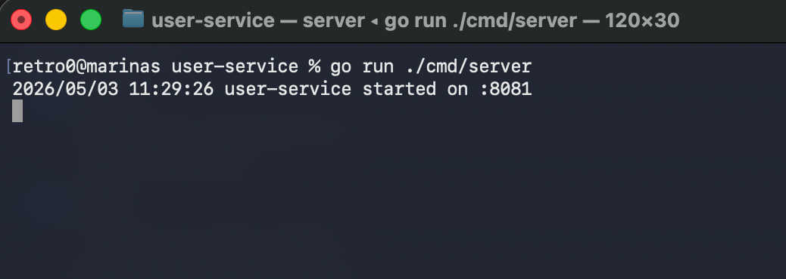
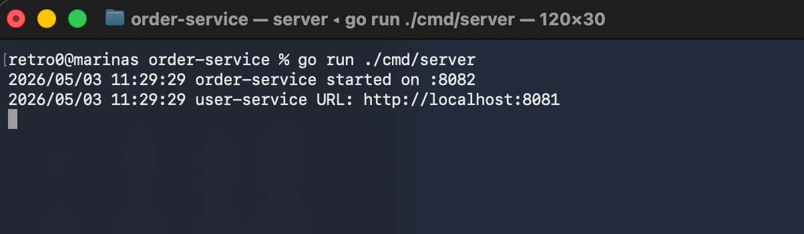
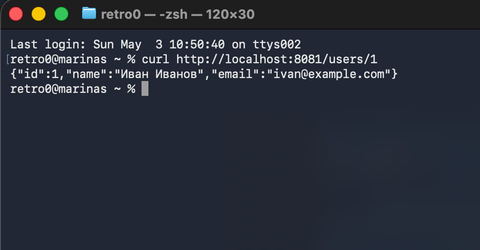
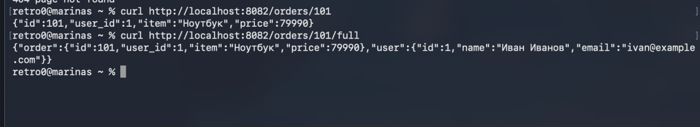
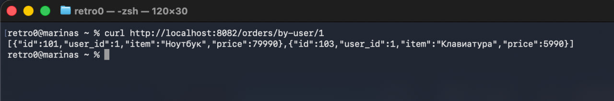

# Практическое занятие №1: разделение монолита на 2 микросервиса

Учебный проект на Go: два независимых HTTP-сервиса взаимодействуют между собой через JSON API.

- `user-service` отвечает за пользователей и работает на `:8081`.
- `order-service` отвечает за заказы и работает на `:8082`.
- `order-service` обращается к `user-service`, когда нужен полный заказ с данными пользователя.

## Структура проекта

```text
pz1-microservices/
  user-service/
    cmd/server/main.go
    internal/user/model.go
    internal/user/repo.go
    internal/user/handler.go
    internal/middleware/logging.go
    go.mod

  order-service/
    cmd/server/main.go
    internal/order/model.go
    internal/order/repo.go
    internal/order/client.go
    internal/order/handler.go
    internal/middleware/logging.go
    go.mod

  go.work
```

## Что реализовано

Базовая часть:

- `GET /users/{id}` — получить пользователя по ID.
- `GET /orders/{id}` — получить заказ по ID.
- `GET /orders/{id}/full` — получить заказ вместе с пользователем через HTTP-вызов `user-service`.
- Обработка ошибок: неверный ID, несуществующий пользователь/заказ, недоступность `user-service`.
- Таймаут HTTP-клиента `3s`.

Дополнительная часть:

- `GET /users` — список всех пользователей.
- `GET /orders/by-user/{userID}` — список заказов конкретного пользователя.
- Middleware логирования запросов в обоих сервисах.
- Адрес `user-service` читается из переменной окружения `USER_SERVICE_URL`, по умолчанию используется `http://localhost:8081`.

## Требования

- картошка и что-то похожее на норм ОС (винда -> харам)

Проверка Go:

```bash
go version
```

## Запуск на macOS

Откройте первый терминал:

```bash
cd pz1-microservices/user-service
go run ./cmd/server
```

Ожидаемо:

```text
user-service started on :8081
```

Откройте второй терминал:

```bash
cd pz1-microservices/order-service
go run ./cmd/server
```

Ожидаемо:

```text
order-service started on :8082
```

## Проверка через curl

### 1. Получить пользователя

```bash
curl http://localhost:8081/users/1
```

Ожидаемый ответ:

```json
{"id":1,"name":"Иван Иванов","email":"ivan@example.com"}
```

### 2. Получить список пользователей

```bash
curl http://localhost:8081/users
```

### 3. Получить заказ

```bash
curl http://localhost:8082/orders/101
```

Ожидаемый ответ:

```json
{"id":101,"user_id":1,"item":"Ноутбук","price":79990}
```

### 4. Получить полный заказ с пользователем

```bash
curl http://localhost:8082/orders/101/full
```

Ожидаемый ответ:

```json
{
  "order": {
    "id": 101,
    "user_id": 1,
    "item": "Ноутбук",
    "price": 79990
  },
  "user": {
    "id": 1,
    "name": "Иван Иванов",
    "email": "ivan@example.com"
  }
}
```

### 5. Получить заказы пользователя

```bash
curl http://localhost:8082/orders/by-user/1
```

Ожидаемо вернутся заказы пользователя с `user_id = 1`.

### 6. Проверить ошибку 404

```bash
curl -i http://localhost:8081/users/999
curl -i http://localhost:8082/orders/999
```

### 7. Проверить ошибку 502

Остановите `user-service`, оставьте `order-service` запущенным и выполните:

```bash
curl -i http://localhost:8082/orders/101/full
```

Ожидаемо `order-service` вернёт `502 Bad Gateway`, потому что он не смог получить пользователя из другого сервиса.

## Скриншоты

----

----

----

----

----

----



## Краткий вывод

В проекте реализована простая микросервисная архитектура. В монолите модуль заказов мог бы напрямую вызвать функцию получения пользователя. Здесь `order-service` не имеет доступа к коду `user-service`, поэтому получает данные по HTTP. Это показывает главный смысл практики: сервисы становятся независимыми, но появляются сетевые ошибки, таймауты и необходимость проектировать API между сервисами.

## Контрольные вопросы

### 1. Чем монолит отличается от микросервисной архитектуры?

Монолит — это одно приложение, где вся логика находится в одном процессе. Микросервисная архитектура — это несколько отдельных сервисов, каждый отвечает за свою область и взаимодействует с другими сервисами по сети.

### 2. Почему разделение системы на сервисы не всегда является лучшим решением?

Потому что микросервисы усложняют разработку: появляются сетевые ошибки, отдельные деплои, мониторинг, настройки адресов, таймауты и сложнее становится отладка.

### 3. Какую ответственность несёт user-service, а какую order-service?

`user-service` хранит и отдаёт пользователей. `order-service` хранит и отдаёт заказы. Для полного ответа по заказу `order-service` обращается к `user-service`.

### 4. Почему важно обрабатывать таймауты и сетевые ошибки?

Потому что другой сервис может быть выключен, зависнуть или отвечать слишком долго. Без таймаутов вызывающий сервис может надолго зависнуть и перестать нормально обслуживать запросы.

### 5. Что означает статус 502 Bad Gateway?

В этой работе `502 Bad Gateway` означает, что `order-service` получил запрос, но не смог корректно получить данные от внешнего сервиса `user-service`.

### 6. Почему один сервис не должен напрямую обращаться к внутренним структурам кода другого сервиса?

Потому что тогда сервисы снова становятся связанными как монолит. Правильнее взаимодействовать через публичный API, чтобы каждый сервис можно было запускать, менять и развивать отдельно.

### 7. Какие преимущества даёт разделение на сервисы при росте проекта?

Можно независимо развивать, запускать, масштабировать и обновлять отдельные части системы. Разные команды могут работать над разными сервисами.

### 8. Какие новые сложности появляются после такого разделения?

Появляются сетевые ошибки, таймауты, необходимость логирования, мониторинга, настройки адресов сервисов, обработки частичных отказов и поддержки API-контрактов.
