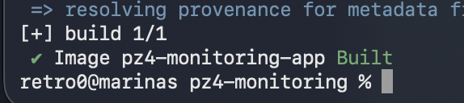
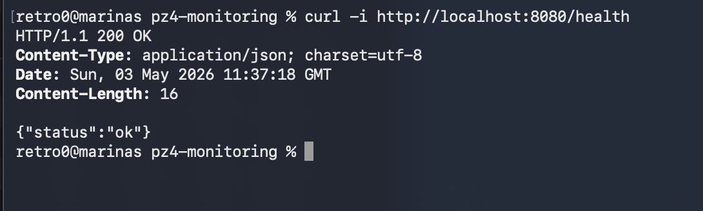
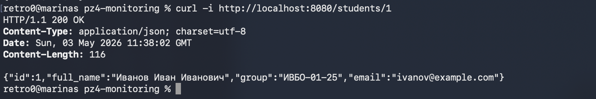
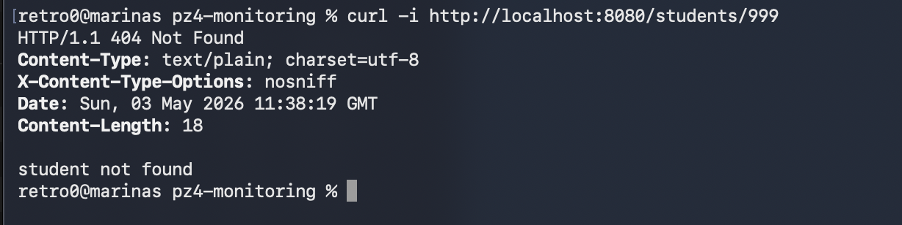
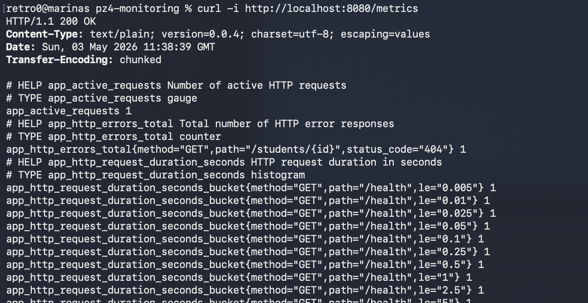
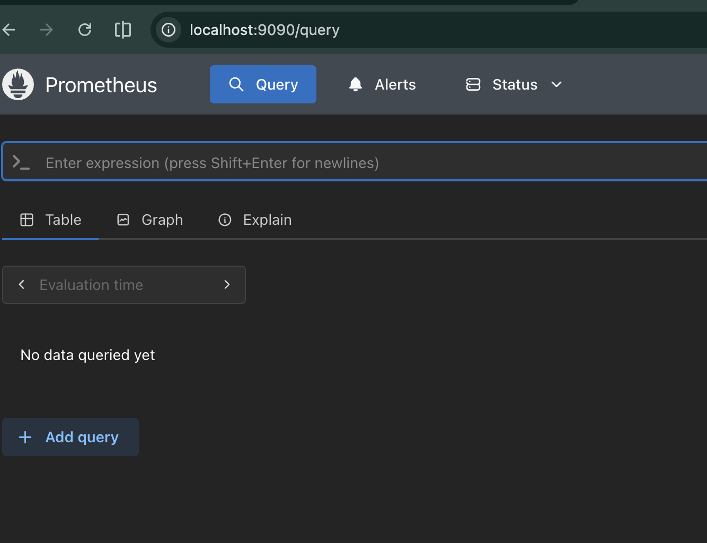
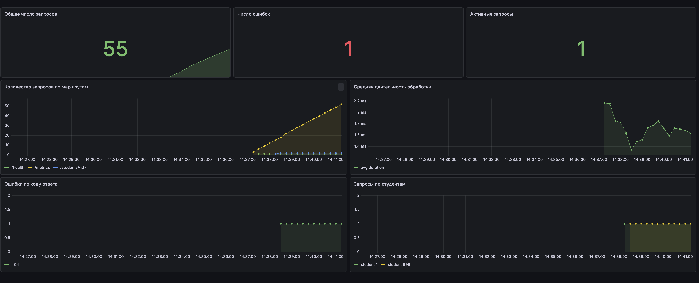

# Практическое занятие №4: Go + Prometheus + Grafana

Проект реализует учебное backend-приложение на Go с endpoint `/metrics` для Prometheus и готовым дашбордом Grafana.

## Что реализовано

- `GET /health` — проверка состояния приложения.
- `GET /students/{id}` — получение студента из тестового репозитория.
- `GET /metrics` — публикация метрик в формате Prometheus.
- Метрики:
  - `app_http_requests_total` — общее количество HTTP-запросов.
  - `app_http_errors_total` — количество ошибочных ответов.
  - `app_http_request_duration_seconds` — длительность HTTP-запросов.
  - `app_active_requests` — число активных запросов.
  - `app_student_requests_total` — количество запросов по студентам.
  - `app_student_request_duration_seconds` — длительность запросов к `/students/{id}`.
- Prometheus собирает метрики каждые 5 секунд.
- Grafana автоматически получает Prometheus как datasource и готовый dashboard.

## Структура проекта

```text
pz4-monitoring/
  cmd/server/main.go
  internal/httpapi/handler.go
  internal/httpapi/middleware.go
  internal/httpapi/response_writer.go
  internal/metrics/metrics.go
  internal/student/model.go
  internal/student/repo.go
  monitoring/prometheus.yml
  monitoring/prometheus.docker.yml
  monitoring/grafana/
  docker-compose.yml
  Dockerfile
  go.mod
```

## Запуск на macOS через Docker Compose

```bash
go mod tidy
docker compose up --build
```

После запуска:

- Go API: <http://localhost:8080>
- Metrics: <http://localhost:8080/metrics>
- Prometheus: <http://localhost:9090>
- Grafana: <http://localhost:3000>

Логин/пароль Grafana:

```text
admin / admin
```

Дашборд Grafana уже будет создан автоматически: **Go Monitoring / Go App Monitoring**.

## Локальный запуск Go-приложения без Docker

```bash
go mod tidy
go run ./cmd/server
```

Проверка:

```bash
curl http://localhost:8080/health
curl http://localhost:8080/students/1
curl http://localhost:8080/students/2
curl http://localhost:8080/students/999
curl http://localhost:8080/metrics | grep app_http
```

## Генерация данных для графиков на macOS

```bash
for i in {1..20}; do curl -s http://localhost:8080/health > /dev/null; done
for i in {1..15}; do curl -s http://localhost:8080/students/1 > /dev/null; done
for i in {1..5}; do curl -s http://localhost:8080/students/999 > /dev/null; done
```

После этого в Grafana обновятся панели по запросам, ошибкам и длительности обработки.

## Полезные PromQL-запросы

```promql
sum(app_http_requests_total)
```

```promql
sum(app_http_errors_total)
```

```promql
sum by (path) (app_http_requests_total)
```

```promql
sum(rate(app_http_request_duration_seconds_sum[1m]))
/
sum(rate(app_http_request_duration_seconds_count[1m]))
```

```promql
sum by (status_code) (app_http_errors_total)
```

```promql
sum by (student_id) (app_student_requests_total)
```

## Скриншоты

----

----

----

----

----

----

----
