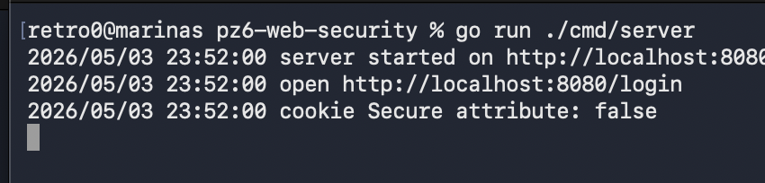
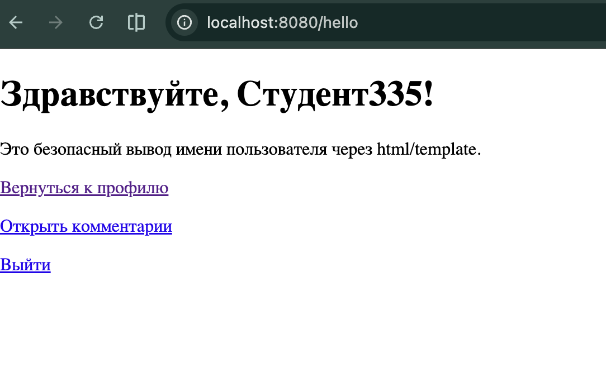
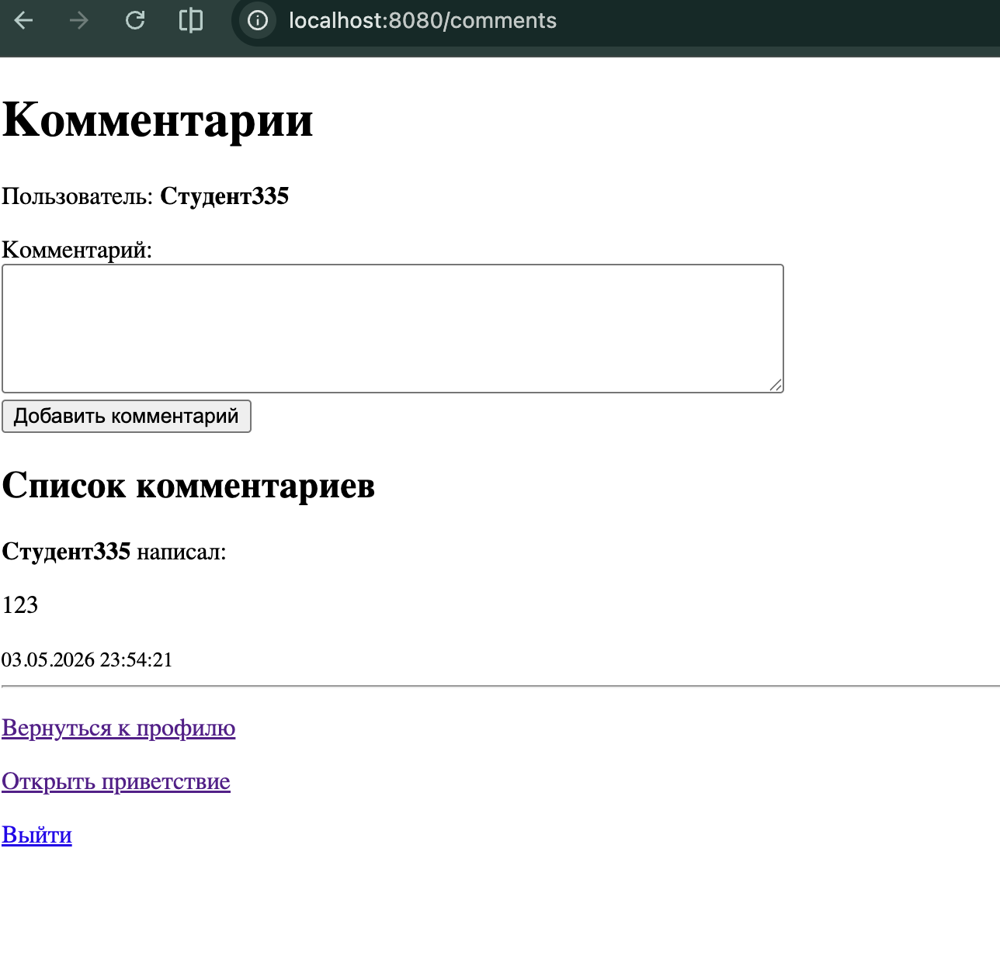
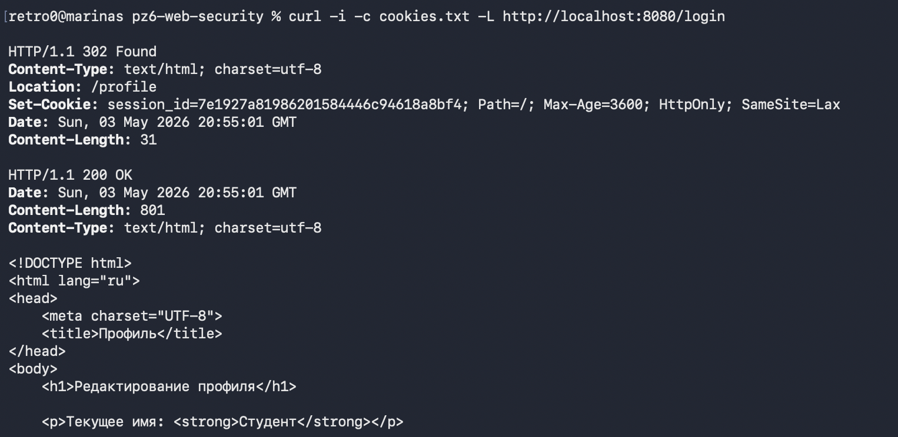

# Практическое занятие №6: CSRF/XSS и secure cookies на Go

Учебное web-приложение на Go для демонстрации:

- авторизационной cookie;
- атрибутов `HttpOnly`, `Secure`, `SameSite`;
- CSRF-токена в HTML-форме;
- проверки CSRF-токена на backend;
- безопасного вывода пользовательских данных через `html/template`;
- защиты от XSS при выводе имени и комментариев.

## Стек

- Go
- standard library: `net/http`, `html/template`, `crypto/rand`
- in-memory хранилище

## Структура проекта

```text
pz6-web-security/
  cmd/
    server/
      main.go
  internal/
    auth/
      cookie.go
      csrf.go
    httpapi/
      handler.go
    store/
      store.go
  templates/
    profile.html
    hello.html
    comments.html
  go.mod
  README.md
```

## Запуск

```bash
go run ./cmd/server
```

Открыть в браузере:

```text
http://localhost:8080/login
```


## HTTPS-режим для cookie Secure

При локальном HTTP `Secure=false`, потому что браузер не будет отправлять Secure-cookie по обычному HTTP.

Для HTTPS-сценария можно включить:

```bash
COOKIE_SECURE=true go run ./cmd/server
```

## Маршруты

| Метод | Путь | Назначение |
|---|---|---|
| GET | `/login` | Создаёт сессию, CSRF-токен и cookie |
| GET | `/profile` | Показывает форму изменения имени |
| POST | `/profile` | Проверяет CSRF-токен и меняет имя |
| GET | `/hello` | Безопасно выводит имя пользователя |
| GET | `/comments` | Показывает форму и список комментариев |
| POST | `/comments` | Проверяет CSRF-токен и добавляет комментарий |
| GET | `/logout` | Удаляет сессию и очищает cookie |

## Проверка через браузер

1. Открыть `/login`.
2. После редиректа должна открыться страница `/profile`.
3. Ввести имя `Иван` и нажать «Сохранить».
4. Должна открыться страница `/hello` с текстом `Здравствуйте, Иван!`.
5. Вернуться в профиль и ввести `<script>alert('xss')</script>`.
6. На странице должен показаться текст, а alert не должен выполниться.
7. Открыть `/comments` и проверить, что комментарии тоже выводятся безопасно.

## Проверка через curl

```bash
curl -i -c cookies.txt -L http://localhost:8080/login
```

Получить CSRF-токен из формы:

```bash
TOKEN=$(curl -s -b cookies.txt http://localhost:8080/profile | sed -n 's/.*name="csrf_token" value="\([^"]*\)".*/\1/p')
echo "$TOKEN"
```

Проверить ошибку CSRF:

```bash
curl -i -b cookies.txt -X POST \
  -d "csrf_token=bad-token" \
  --data-urlencode "name=Хакер" \
  http://localhost:8080/profile
```

Ожидается:

```text
HTTP/1.1 403 Forbidden
invalid csrf token
```

Успешно изменить имя:

```bash
curl -i -b cookies.txt -c cookies.txt -X POST \
  --data-urlencode "csrf_token=$TOKEN" \
  --data-urlencode "name=Иван" \
  http://localhost:8080/profile
```

Проверить страницу приветствия:

```bash
curl -s -b cookies.txt http://localhost:8080/hello
```

Проверить XSS-строку:

```bash
TOKEN=$(curl -s -b cookies.txt http://localhost:8080/profile | sed -n 's/.*name="csrf_token" value="\([^"]*\)".*/\1/p')

curl -i -b cookies.txt -c cookies.txt -X POST \
  --data-urlencode "csrf_token=$TOKEN" \
  --data-urlencode "name=<script>alert('xss')</script>" \
  http://localhost:8080/profile

curl -s -b cookies.txt http://localhost:8080/hello
```

В HTML должен быть экранированный текст, а не исполняемый JavaScript.

## 3. Скриншоты

----

----

----

----

## Ответы на контрольные вопросы

1. CSRF — это атака, при которой браузер пользователя отправляет запрос на сайт от его имени без осознанного действия пользователя.
2. Cookie прикладывается браузером автоматически, поэтому наличие cookie доказывает только наличие сессии, но не доказывает намерение пользователя выполнить действие.
3. XSS — это внедрение вредоносного JavaScript или HTML в страницу через пользовательский ввод.
4. CSRF атакует механизм авторизованного запроса, а XSS атакует отображение данных в браузере.
5. CSRF-токен нужен, чтобы сервер мог проверить, что запрос пришёл из формы, выданной самим сервером текущей сессии.
6. `HttpOnly` запрещает доступ к cookie из JavaScript.
7. `Secure` заставляет браузер отправлять cookie только по HTTPS.
8. `SameSite` ограничивает отправку cookie в межсайтовых запросах и снижает риск CSRF.
9. Нельзя вставлять пользовательский ввод через конкатенацию строк, потому что браузер может воспринять ввод как HTML или JavaScript.
10. Шаблоны безопаснее ручной сборки HTML, потому что `html/template` автоматически экранирует специальные символы.
