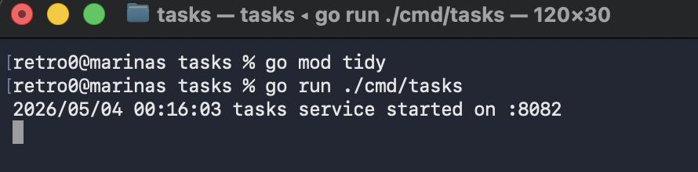
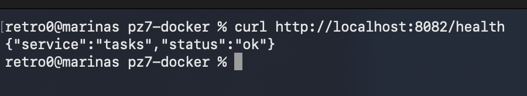
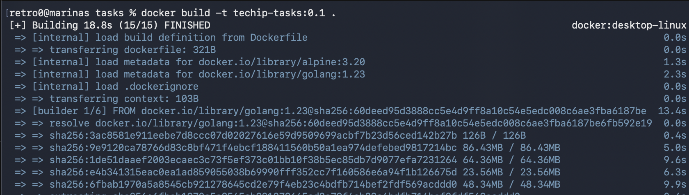
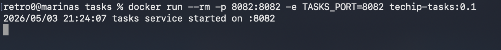
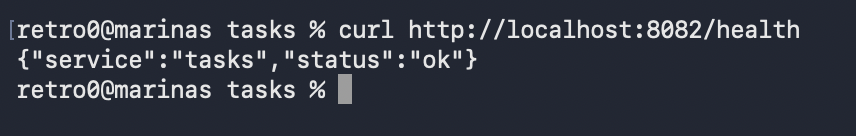
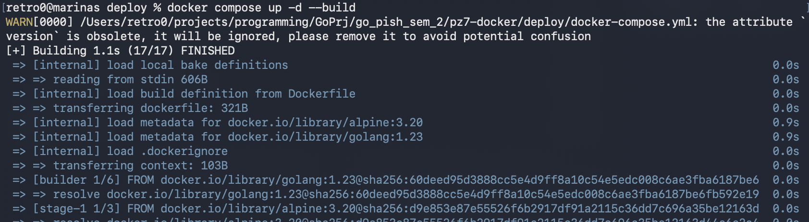
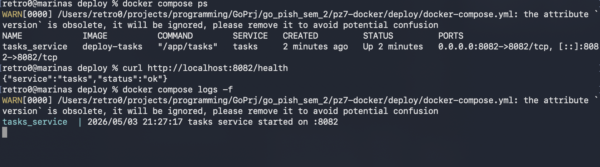

# Практическое занятие №7

## Тема

Написание Dockerfile и сборка контейнера для backend-приложения на Go.

## Цель работы

Освоить контейнеризацию backend-приложения на Go с помощью Docker: написать `Dockerfile`, собрать Docker-образ, запустить контейнер и проверить работу сервиса через HTTP-запрос.

## Структура проекта

```text
pz7-docker/
├── deploy/
│   └── docker-compose.yml
├── services/
│   └── tasks/
│       ├── cmd/
│       │   └── tasks/
│       │       └── main.go
│       ├── internal/
│       ├── .dockerignore
│       ├── Dockerfile
│       └── go.mod
├── .gitignore
└── README.md
```

## Описание сервиса

Сервис `tasks` запускает HTTP-сервер и слушает порт `8082`. Порт можно изменить через переменную окружения `TASKS_PORT`.

Тестовый маршрут:

```text
GET /health
```

Ожидаемый ответ:

```json
{"service":"tasks","status":"ok"}
```

## Локальный запуск без Docker

```bash
cd services/tasks
go mod tidy
go run ./cmd/tasks
```

Проверка во втором окне терминала:

```bash
curl http://localhost:8082/health
```


## Сборка Docker-образа

```bash
cd services/tasks
docker build -t techip-tasks:0.1 .
```

Проверка списка образов:

```bash
docker images
```


## Запуск контейнера

```bash
docker run --rm -p 8082:8082 -e TASKS_PORT=8082 techip-tasks:0.1
```

## Запуск через Docker Compose

```bash
cd deploy
docker compose up -d --build
```

Проверка запущенных контейнеров:

```bash
docker compose ps
```

Просмотр логов:

```bash
docker compose logs -f
```

Проверка сервиса:

```bash
curl http://localhost:8082/health
```


## Остановка Docker Compose

```bash
cd deploy
docker compose down
```

## Скриншоты


----

----

----

----

----

----

----


## Ответы на контрольные вопросы

### 1. Чем Docker-образ отличается от контейнера?

Docker-образ — это шаблон, из которого создается контейнер. Контейнер — это уже запущенный экземпляр образа.

### 2. Зачем нужен Dockerfile?

`Dockerfile` нужен для описания шагов сборки Docker-образа: какую базовую среду использовать, какие файлы копировать, какие команды выполнить и что запускать при старте контейнера.

### 3. Что такое multi-stage build?

`multi-stage build` — это подход, при котором сборка приложения выполняется в одном образе, а запуск происходит в другом, более легком образе.

### 4. Почему для Go-сервисов удобно использовать multi-stage build?

Go-приложение компилируется в бинарный файл. Поэтому можно собрать бинарник в образе с Go, а в финальный образ положить только готовый исполняемый файл.

### 5. Зачем нужен .dockerignore?

`.dockerignore` исключает лишние файлы из Docker build context. Это ускоряет сборку и не добавляет в образ мусор вроде `.git`, логов, временных файлов и локальных настроек IDE.

### 6. Для чего используются переменные окружения в контейнере?

Переменные окружения позволяют передавать настройки в контейнер без изменения кода и без пересборки Docker-образа.

### 7. Что делает флаг -p при запуске контейнера?

Флаг `-p` пробрасывает порт с хостовой машины внутрь контейнера. Например, `-p 8082:8082` означает, что порт `8082` на компьютере будет направлен на порт `8082` внутри контейнера.

### 8. Для чего нужен Docker Compose?

Docker Compose нужен для описания и запуска одного или нескольких контейнеров через YAML-файл. Это удобнее, чем каждый раз писать длинные команды `docker run`.

### 9. Почему контейнеризация упрощает деплой?

Контейнер содержит приложение и известную среду выполнения. Благодаря этому сервис можно одинаково запускать локально, на сервере, в CI/CD или в оркестраторе.

### 10. Почему не стоит вшивать конфигурацию и секреты прямо в образ?

Если вшить секреты в образ, они могут попасть в репозиторий или registry. Безопаснее передавать конфигурацию и секреты через переменные окружения или специальные secret-хранилища.
