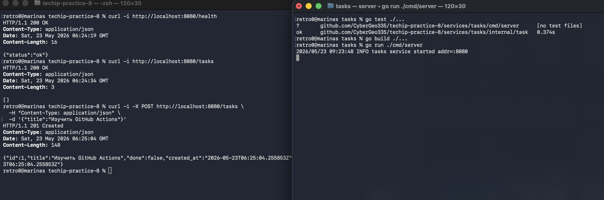
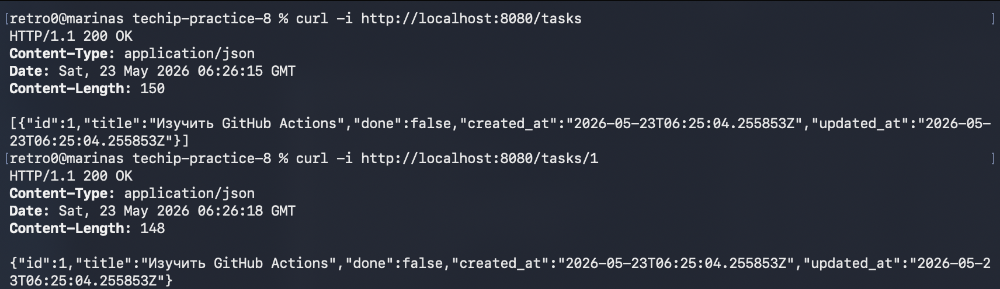
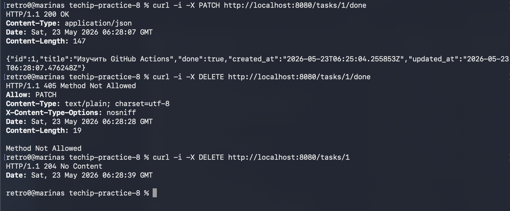

# Практическое занятие №8 — CI/CD для backend-проекта на Go

## 1. Тема и цель работы

**Тема:** настройка GitHub Actions для проверки, сборки и Docker-сборки Go-приложения.

**Цель:** освоить базовую настройку CI/CD для backend-проекта на Go: локально проверить сервис, добавить тесты, подготовить Dockerfile, описать pipeline GitHub Actions и понять, где должны храниться secrets.

Проект сделан в отдельной папке `techip-practice-8`. Внутри архива нет `.git` и не выполнялся `git init`.

## 2. Выбранная платформа CI/CD

Файл pipeline находится здесь:

```text
.github/workflows/ci.yml
```

## 3. Структура проекта

```text
techip-practice-8/
├── .github/
│   └── workflows/
│       └── ci.yml
├── services/
│   └── tasks/
│       ├── cmd/
│       │   └── server/
│       │       └── main.go
│       ├── internal/
│       │   └── task/
│       │       ├── handler.go
│       │       ├── handler_test.go
│       │       ├── model.go
│       │       ├── store.go
│       │       └── store_test.go
│       ├── .dockerignore
│       ├── Dockerfile
│       └── go.mod
├── .gitignore
├── docker-compose.yml
├── Makefile
└── README.md
```

## 4. Что реализовано в сервисе tasks

Сервис `tasks` — минимальное REST API на стандартной библиотеке Go без внешних зависимостей.

| Метод | Путь | Назначение |
|---|---|---|
| `GET` | `/health` | Проверка состояния сервиса |
| `GET` | `/tasks` | Получение списка задач |
| `POST` | `/tasks` | Создание задачи |
| `GET` | `/tasks/{id}` | Получение задачи по ID |
| `PATCH` | `/tasks/{id}/done` | Отметить задачу выполненной |
| `DELETE` | `/tasks/{id}` | Удалить задачу |

Пример тела запроса для создания задачи:

```json
{
  "title": "prepare ci pipeline"
}
```

## 5. CI и CD

**CI**, Continuous Integration, — это непрерывная интеграция. После изменения кода система автоматически получает репозиторий, подготавливает окружение, запускает тесты и выполняет сборку. Это позволяет быстро обнаружить ошибку до ручного деплоя.

**CD** может означать Continuous Delivery или Continuous Deployment. В рамках этой практики CD — это подготовка результата к доставке: Docker-образ, публикация в registry и возможный деплой на сервер.

## 6. Pipeline GitHub Actions

Полный файл `.github/workflows/ci.yml`:

```yaml
name: CI Pipeline

on:
  push:
    branches: ["main", "master"]
  pull_request:
    branches: ["main", "master"]

jobs:
  test-and-build:
    runs-on: ubuntu-latest
    defaults:
      run:
        working-directory: ./services/tasks
    steps:
      - name: Checkout repository
        uses: actions/checkout@v4

      - name: Setup Go
        uses: actions/setup-go@v5
        with:
          go-version: "1.23"

      - name: Show Go version
        run: go version

      - name: Download dependencies
        run: go mod download

      - name: Check formatting
        run: test -z "$(gofmt -l .)"

      - name: Run tests
        run: go test ./...

      - name: Build application
        run: go build ./...

  docker-build:
    runs-on: ubuntu-latest
    needs: test-and-build
    steps:
      - name: Checkout repository
        uses: actions/checkout@v4

      - name: Set up Docker Buildx
        uses: docker/setup-buildx-action@v3

      - name: Build Docker image
        run: docker build -t techip-tasks:${{ github.sha }} .
        working-directory: ./services/tasks
```

## 7. Пояснение job в pipeline

### `test-and-build`

Этот job выполняет базовую CI-проверку:

1. получает код из репозитория через `actions/checkout@v4`;
2. устанавливает Go 1.23 через `actions/setup-go@v5`;
3. показывает версию Go;
4. загружает зависимости;
5. проверяет форматирование через `gofmt`;
6. запускает тесты командой `go test ./...`;
7. выполняет сборку командой `go build ./...`.

### `docker-build`

Этот job запускается только после успешного `test-and-build`, потому что указан параметр:

```yaml
needs: test-and-build
```

Он собирает Docker-образ командой:

```bash
docker build -t techip-tasks:${{ github.sha }} .
```

## 8. Тег Docker-образа

В CI используется тег:

```text
${{ github.sha }}
```

Это полный hash коммита GitHub. Такой тег полезен, потому что по нему можно понять, из какой версии кода был собран конкретный Docker-образ.

Для локальной проверки используется учебный тег:

```bash
docker build -t techip-tasks:0.1 ./services/tasks
```

## 9. Где хранить secrets

Секреты нельзя хранить в репозитории, `.env`, README или YAML-файле pipeline.

Для GitHub Actions их нужно хранить здесь:

```text
GitHub repository → Settings → Secrets and variables → Actions
```

Примеры secrets:

```text
REGISTRY_USERNAME
REGISTRY_PASSWORD
SSH_PRIVATE_KEY
```

Они нужны для публикации Docker-образа в registry, подключения к серверу по SSH или работы с внешними токенами.

## 10. Команды запуска и проверки на MacOS от А до Я

### 10.1. Установить инструменты

Проверить Go:

```bash
go version
```

Проверить Git:

```bash
git --version
```

Проверить Docker Desktop:

```bash
docker version
```

```bash
cd services/tasks
```

### 10.2. Загрузить зависимости

```bash
go mod download
```

В проекте нет внешних зависимостей, но команда нужна для корректной CI-проверки.

### 10.3. Проверить форматирование

```bash
gofmt -w .
test -z "$(gofmt -l .)"
```

### 10.4. Запустить тесты

```bash
go test ./...
```

Ожидаемый результат:

```text
ok   github.com/CyberGeo335/techip-practice-8/services/tasks/internal/task
```

### 10.5. Собрать приложение

```bash
go build ./...
```

Если команда завершилась без ошибок, backend-проект собирается корректно.

### 10.9. Запустить приложение локально

```bash
HTTP_ADDR=:8080 go run ./cmd/server
```

В другом окне терминала проверить health endpoint:

```bash
curl -i http://localhost:8080/health
```

Ожидаемый ответ:

```text
HTTP/1.1 200 OK
Content-Type: application/json

{"status":"ok"}
```

Создать задачу:

```bash
curl -i -X POST http://localhost:8080/tasks \
  -H 'Content-Type: application/json' \
  -d '{"title":"prepare ci pipeline"}'
```

Получить список задач:

```bash
curl -i http://localhost:8080/tasks
```

Отметить задачу выполненной:

```bash
curl -i -X PATCH http://localhost:8080/tasks/1/done
```

Удалить задачу:

```bash
curl -i -X DELETE http://localhost:8080/tasks/1
```

### 10.10. Собрать Docker-образ

Вернуться в корень проекта:

```bash
cd ../..
```

Собрать образ:

```bash
docker build -t techip-tasks:0.1 ./services/tasks
```

Запустить контейнер:

```bash
docker run --rm -p 8080:8080 --name techip-tasks techip-tasks:0.1
```

Проверить в другом терминале:

```bash
curl -i http://localhost:8080/health
```

Остановить контейнер:

```bash
docker stop techip-tasks
```

### 10.11. Запустить через Docker Compose

```bash
docker compose up --build
```

Проверка:

```bash
curl -i http://localhost:8080/health
```

Остановка:

```bash
docker compose down
```

### 10.12. Проверка через Makefile

Из корня проекта:

```bash
make test
make build
make docker-build
make run
```


## 11. Проверка GitHub Actions

После push открыть в GitHub вкладку:

```text
Actions → CI Pipeline
```

Ожидаемый результат:

```text
test-and-build — success
docker-build — success
```
## 11.5. Скриншоты

----

----


## 12. Контрольные вопросы

### 1. Чем CI отличается от CD?

CI отвечает за автоматическую проверку и сборку кода после изменений. CD отвечает за подготовку приложения к доставке или автоматическое развёртывание: публикацию Docker-образа, доставку на сервер и запуск.

### 2. Почему pipeline должен запускать тесты?

Тесты позволяют автоматически обнаружить ошибки после изменения кода. Если тесты падают, pipeline останавливается и не допускает сборку Docker-образа из потенциально сломанной версии.

### 3. Зачем нужен автоматический build?

Автоматический build подтверждает, что проект собирается в чистом окружении CI, а не только на компьютере разработчика. Это снижает риск ситуации, когда локально всё работает из-за случайных настроек, а на сервере приложение не собирается.

### 4. Почему важно собирать Docker-образ в CI, а не только локально?

Docker build в CI делает сборку воспроизводимой. Команда видит, что образ можно собрать из текущего состояния репозитория, а не только из локальной папки одного разработчика.

### 5. Что такое CI secrets?

CI secrets — это защищённые переменные CI-системы для хранения паролей, токенов, SSH-ключей и других чувствительных данных.

### 6. Почему нельзя хранить токены и SSH-ключи в репозитории?

Потому что репозиторий может быть публичным или доступным другим участникам. Попавший в репозиторий токен может быть украден и использован для доступа к registry, серверу или другим сервисам.

### 7. Для чего нужен тег Docker-образа?

Тег нужен для идентификации версии образа. Например, тег по hash коммита показывает, из какого состояния кода был собран конкретный образ.

### 8. Что делает job `docker-build`?

Job `docker-build` получает код, подготавливает Docker Buildx и собирает Docker-образ сервиса `tasks`. Он запускается только после успешных тестов и сборки Go-приложения.

### 9. Почему в multi-service проекте важен `working-directory`?

В multi-service проекте у каждого сервиса может быть свой `go.mod`, Dockerfile и структура каталогов. Если указать неправильный `working-directory`, CI будет запускать команды не в той папке и не найдёт нужные файлы.

### 10. Какие риски возникают при полностью автоматическом деплое?

Основные риски: автоматическая доставка ошибочной версии, некорректная миграция данных, потеря доступности сервиса, неправильные secrets, проблемы с rollback и недостаточный контроль перед выкладкой в production.
